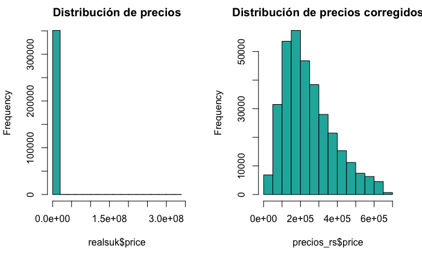
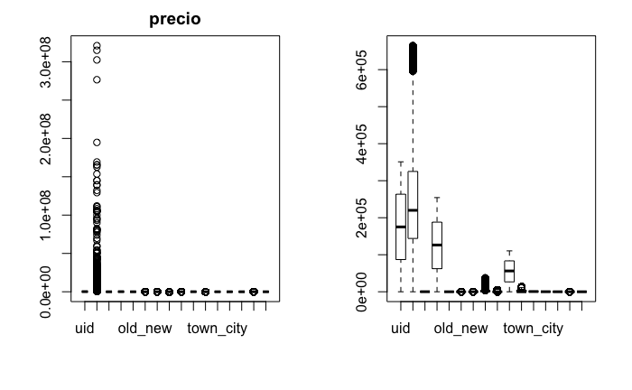
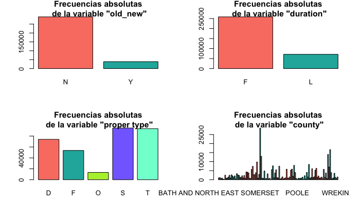

# ProyectoFinal-PDC

Repositorio para el proyecto final de la materia **Programación para ciencia de Datos**. Otoño 2019.

## Integrantes 

+ Mario Alberto Rodríguez Arias 164471
+ Mario Alberto Cruz García 123808
+ Victor Guardado 13XXXX

## Objetivo del Proyecto 

El presente proyecto tiene como objetivo el poner en práctica los conocimientos aprendidos en la clase de **programación para ciencia de datos**. 

### Requerimientos del proyecto

+ Crear un repositorio
+ Crear una estructura de carpetas  para un proyecto en python
+ Escoger una fuente de datos
+ Crear un README.md: Describir la fuente de datos. Describir la entidad, estructura de la base de datos, *pipeline*. Instalación. Ejecución.
+ Cargar la base de datos a raw
+ Crear una versión limpia en *cleaned* 
+ Crear un esquema *semantic*
+ Crear _features_ temporales ligados a la entidad dadas las fechas del evento. Guardarlos en el esquema *features*

## Base de datos

La base de datos que se eligió es la de **Information about price paid data** del gobierno británico. Dentro del compilado
de **Land Registration (UK)**. 
Esta base de datos tiene información de los precios pagados por propiedades en venta en Inglaterra y Gales. Los datos utilizados para el presente proyectos son los correspondientes a lo que va del 2019.

Fuente: https://www.gov.uk/government/statistical-data-sets/price-paid-data-downloads

Tiene un total de 15 variables y 103,483 observaciones.

### Explicación de los encabezados en las columnas

|         **Data item**     |      **Descripción**        |   **Tipo**   |
|:----------------------|:------------------------|:---------------------|
|_uid_          |Número de referencia generado automáticamente| Texto |
|_precio_                 |Precio de venta|  numérico|
|_date_of_transfer_|fecha en que se completó la venta| fecha|
|_postcode_|Código postal|Texto|
|_propert_type_|independiente, piso, etc| caracter|
|_old_new_|Indica la edad de la propiedad|caracter|
|_duration_|Se refiere al tipo de tenencia|caracter|
|_PAON_|Número de la casa|Texto |
|_SAON_|Número interior de la casa|Texto |
|_street_|Calle    |Texto |
|_locality_| Localidad |Texto |
|_town_city_|  Ciudad   |Texto |
|_district_| Distrito |Texto |
|_county_| Condado |Texto |
|_ppd_category_|Indica el tipo de precio pagaso en la transacción|caracter|
|_record_status_|Movimientos en los registros |caracter|

### Análisis exploratorio de los datos

Se realizó un breve análisis de datos para tener una mejor idea de qué se puede hacer con ellos. Y conocer qué presentaban
los datos del presente ejercicio. 

El análisis completo se encuentra en el R Markdown con el EDA. Aquí solamente se expondrán algunos puntos destacables de los
datos.

Primeramente, se econtraron valores atípicos en la variable *price* que corresponde al precio de las viviendas. Había viviendas que valían una sola libra, hasta algunas que valían varios millones. En la siguiente gráfica se pueden observar 
las observaciones de los precios y cómo hay valores atípicos. 

Pero se eliminaron estos errores atípicos y se pudo evitar el sesgo en la visualización y la interpretación de los datos. 
El histograma de los datos una vez corregidos se ve así en comparación de cómo se veía sin la corrección de datos atípicos.

Igualmente, se puede ver cómo están distribuidas las variables con respecto al precio. Igual que en la gráfica anterior se puede
comparar con los preciós sin corrección, no se podía apreciar la verdadera distribución de las variables con los precios.

Y las variables categóricas cómo se distribuyen respecto al precio también. Apreciando una mayor varianza de precios para las
casas nuevas y dentro de la columna *proper_type* la correspondiente a la variable *o*

Por últmio, la comparación de las variables categóricas, para conocer su distribución relativa a las demás. Por ejemplo, qué
proporción de casas son viejas respecto a las nuevas. 

