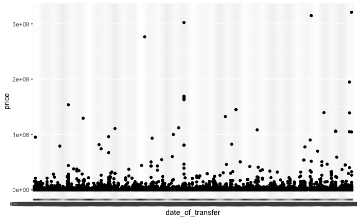
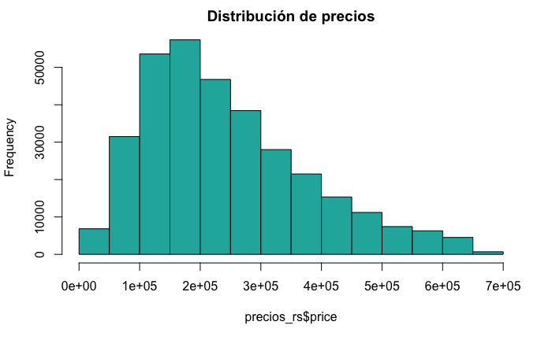
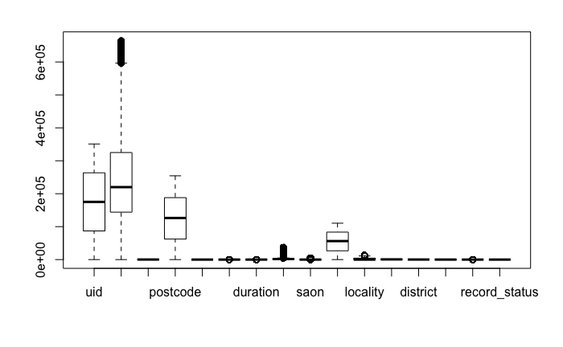
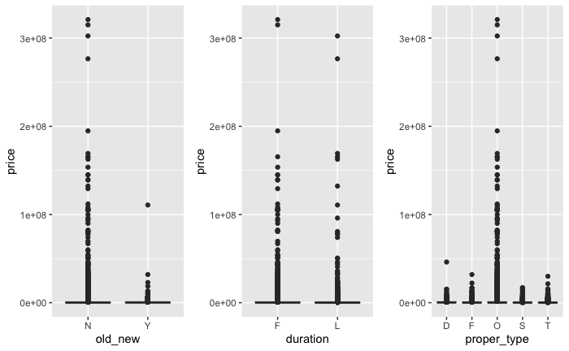

# ProyectoFinal-PDC

Repositorio para el proyecto final de la materia **Programación para ciencia de Datos**. Otoño 2019.

## Objetivo del Proyecto 

El presente proyecto tiene como objetivo el poner en práctica los conocimientos aprendidos en la clase de **programación para ciencia de datos**. 

## Base de datos

La base de datos que se eligió es la de **Information about price paid data** del gobierno británico.
Esta base de datos tiene información de **YYYYYYYY**

### Explicación de los encabezados en las columnas

|         Data item     |      Explicación        |
|----------------------|------------------------|
|identificador          |Número de referencia generado automáticamente|
|precio                 |Precio de venta|
|dia de la transferencia|fecha en que se completó la venta|
|postcode|Código postal|
|Typo de propiedad|independiente, piso, etc|
|Nuevo/viejo|Indica la edad de la propiedad|
|Duración|Se refiere al tipo de tenencia|
|PAON|Número de la casa|
|SAON|Número interior de la casa|
|Calle|    |
|Localidad|    |
|Ciudad|     |
|Distrito|  |
|Condado|  |
|PPD|Indica el tipo de precio pagaso en la transacción|
|Record/status|Movimientos en los registros |

### Análisis exploratorio de los datos

Se realizó un breve análisis de datos para tener una mejor idea de qué se puede hacer con ellos. Y conocer qué presentaban
los datos del presente ejercicio. 

El análisis completo se encuentra en el R Markdown con el EDA. Aquí solamente se expondrán algunos puntos destacables de los
datos.

Primeramente, se econtraron valores atípicos en la variable *price* que corresponde al precio de las viviendas. Había viviendas que valían una sola libra, hasta algunas que valían varios millones. En la siguiente gráfica se pueden observar 
las observaciones de los precios y cómo hay valores atípicos. 

Pero se eliminaron estos errores atípicos y se pudo evitar el sesgo en la visualización y la interpretación de los datos. 
El histograma de los datos una vez corregidos se ve así.

Igualmente, se puede ver cómo están distribuidas las variables con respecto al precio. 

Y las variables categóricas cómo se distribuyen respecto al precio también. 

